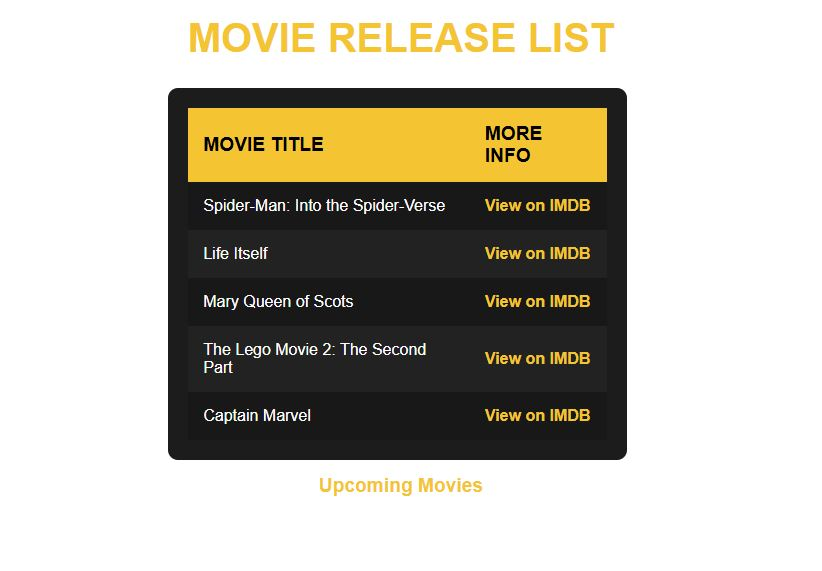

# React Movies

React application that displays a list of up-coming film titles, with links to their IMDB pages.
Aim of this project is to create a basic component based web app

# How to start

* Clone this repository
* Install Node.js onto your machine.
* cd into the root folder of the project
* Run ***npm install*** in the terminal to install the packages for the project

# UI

